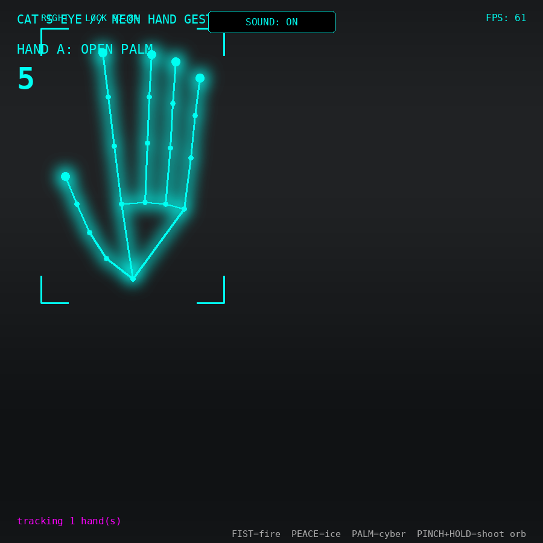
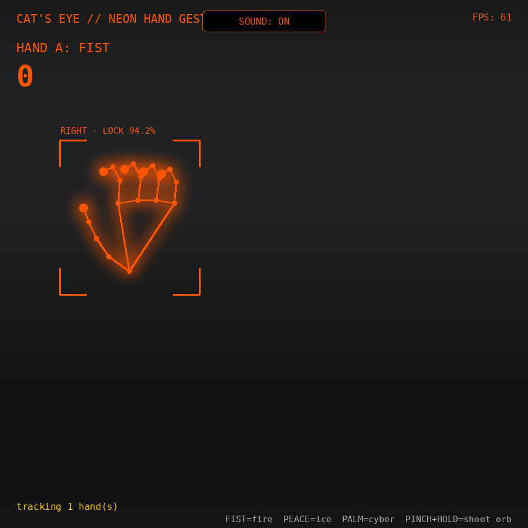
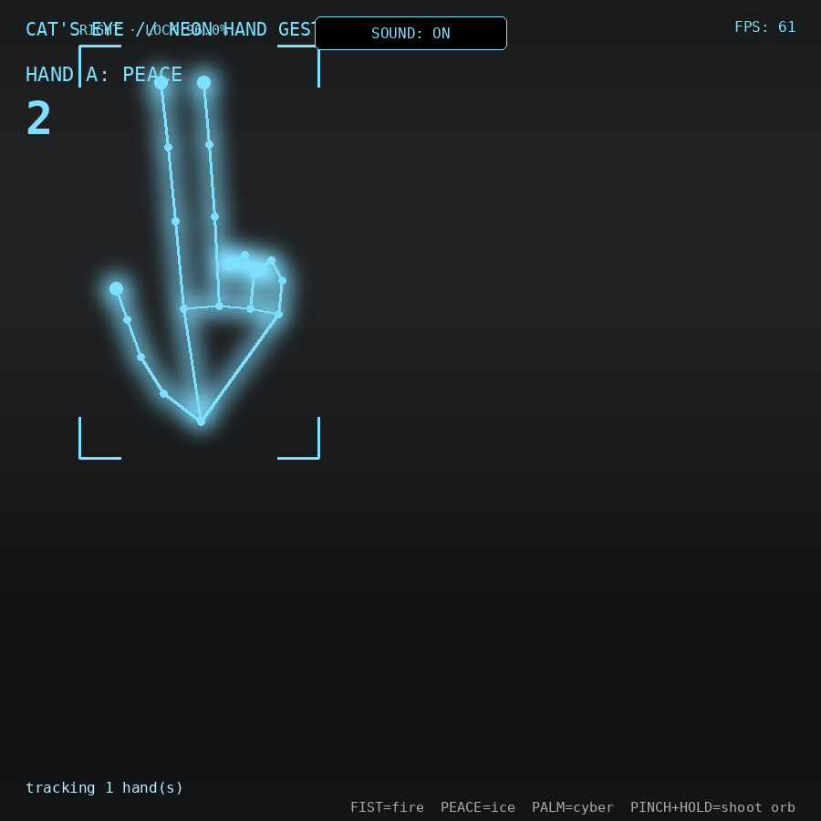
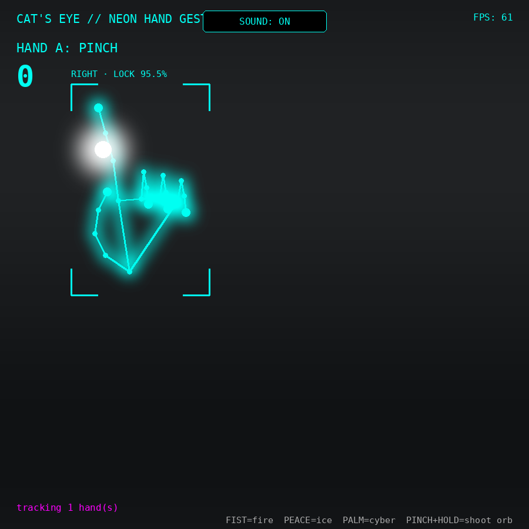

# Neon Hand // Gesture Engine v4

A single-page, webcam-based hand-gesture visualizer built on [MediaPipe Hands](https://developers.google.com/mediapipe). Tracks up to two hands and renders a neon skeleton overlay, particle trails, gesture-driven themes, projectile "shooting" via pinch-and-hold, a two-hand energy bridge, live tracking-confidence HUD readouts, and a simple rep counter.

## Features
- Real-time hand tracking (MediaPipe Hands, vendored locally, no CDN dependency)
- Gesture detection: FIST, OPEN PALM, PINCH, POINT, PEACE
- Gesture-driven visual themes (fire / ice / cyber)
- Web Audio SFX — no audio files required
- Particle system + projectile "orb" shooting (pinch and hold)
- Two-hand "energy bridge" with traveling glint effect
- Technical HUD: per-hand confidence, bounding box, velocity vector, joint-angle readout
- EMA smoothing + hold/fade persistence to reduce tracking jitter/flicker
- Adjustable line thickness / glow intensity / particle density
- Simple hand-proxy bicep-curl rep counter

## Screenshots

| Cyber (default) | Fire | Ice |
|---|---|---|
|  |  |  |

| Pinch-charge | Two-hand bridge |
|---|---|
|  |  |
## Required setup (important)

This app expects local vendored copies of the MediaPipe Hands and Camera Utils scripts — **they are not included in this repo** and must be added before it will run:

```
vendor/
  hands/
    hands.js
    (other MediaPipe hands assets referenced by locateFile, e.g. hand_landmark_lite.tflite, hands_solution_*.js, etc.)
  camera_utils/
    camera_utils.js
```

Get these from the official MediaPipe CDN or npm packages (`@mediapipe/hands`, `@mediapipe/camera_utils`) and drop the files into the folders above, matching the paths referenced in `index.html`'s `<script src>` tags and the `locateFile` callback.

## Running locally

Because it uses `getUserMedia`, this must be served over HTTP (not opened as a `file://` URL):

```bash
npx serve .
# or
python3 -m http.server 8080
```

Then open the printed local URL and grant camera permission.

## Controls
- **FIST** → fire theme, **PEACE** → ice theme, **OPEN PALM** → cyber theme
- **PINCH + hold** → charge and fire a projectile orb
- Bring both hands together while both pinching → energy burst
- Side panel sliders → line thickness, glow intensity, particle density
- Sound toggle button (top center)
